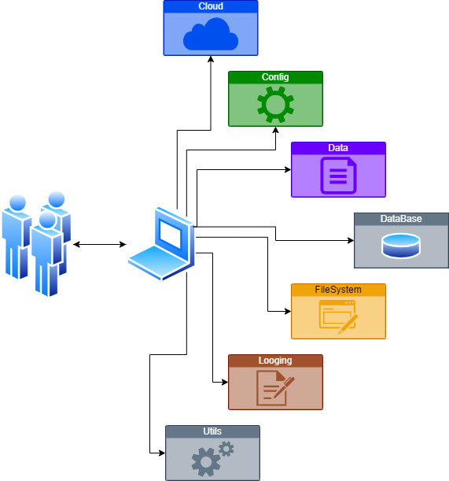

# VillaPy 1.0.6
Python utility library designed to accelerate software development through reusable, production-tested components.

# Overview
VillaPy is a personal Python library that centralizes the utilities, classes, and reusable components frequently used across multiple software, automation, data, data engineering, and analytics projects.  
The goal is to reduce development time, improve code consistency and provide a collection of tested solutions that can be easily integrated into new projects. 

# Problem Statement
Software projects often require implementing the same utilities repeatedly, such as:

- Database connections management
- File system management
- Configuration handling
- Cloud integrations
- Data validation 
- Logging

Duplicating these components across projects increase development time and maintenance complexity.  
VillaPy addresses this challenge by providing a centralized, reusable and production-tested toolkit.

# Features
- Database connection management
- Query execution utilities
- File and directory operations
- Dynamic project configuration
- Data structure validation
- Cloud service integrations
- Logging utilities
- Reusable helper functions

# Technologies
- Python
- Pandas
- SQLAlchemy
- SQLite
- Google API
- Google Auth
- Pytest

# Architecture
 
### Modules
- __cloud__  
    Cloud service integration.
    - azure
    - google
- __config__  
    Project configuration management.
    - dynamic
    - static
- __data__  
    Data validation and manipulation.
    - dataframe
    - dict
    - text
- __dataBase__  
    Database communication.
    - connection
    - query
    - sqlite
- __FileSystem__  
    File and directory management.
    - files_utils
    - mapper
    - path_utils
    - project_creator
- __Logging__  
    Application logging.
    - write_log
- __Utils__  
    Management Functions.
    - functions

# Installation
### Basic Installation
``` bash
pip install git+https://github.com/ElApando/villapy.git
```

``` bash
Optional Dependencies
to use MySQL
pip install "villapy[mysql] @ git+https://github.com/ElApando/villapy.git"

to use SQLServer
pip install "villapy[sqlserver] @ git+https://github.com/ElApando/villapy.git"

to use Encrypt Hash
pip install "villapy[hash] @ git+https://github.com/ElApando/villapy.git"
```

Example function  

```python
from villapy_lib.database.query import QuerysDB  
from app.config.dynamic import DI_CREDENTIAL

class ManageDB:

    def __init__(self):
        self.cl_querys = QuerysDB(DI_CREDENTIAL)
```

# Benefits
- Faster project development
- Reduced code duplication
- Standardized implementations
- Production-tested utilities
- Improved maintainability

# Testing 
PyTest
The project includes automated tests to ensure code quality and reliability

``` bash
pytest -v tests
```

# Roadmap
### Planned Features
- Azure Blob Storage integration
- Google Cloud Storage integration 
- Local Bucket abstraction
- Apache Airflow orchestration support
- Docker deployment support
- CI/CD integration with GitHub Actions

# Author
Juan Rodrigo Villalpando González  
Software Engineer | Python Developer | Automation Solutions | Data Engineer | Data Analyst  
LinkedIn: https://www.linkedin.com/in/juan-villalpando-gonzalez  
GitHub: https://github.com/ElApando  

